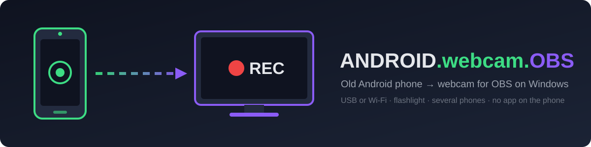

<div align="center">

> 🇷🇺 **Русская версия доступна ниже** — [перейти к русской документации ↓](#ru)



# 📱 ANDROID.webcam.OBS

**Turn the old Android phone in your drawer into a webcam for OBS on Windows — double-click, no app on the phone.**


-3DDC84)


[**Download**](https://github.com/dobrdigital/ANDROID.webcam.OBS/releases/latest) · [**Will my phone work?**](docs/COMPATIBILITY.md) · [**The buttons**](#-the-buttons) · [**Features**](#-features) · [**Troubleshooting**](#-troubleshooting) · [**Русский**](#ru)

</div>

---

## 📥 Install: download → double-click

1. **[Download the zip](https://github.com/dobrdigital/ANDROID.webcam.OBS/releases/latest)** and unzip it anywhere.
2. On the phone: **Developer options → USB debugging ON** ([where is it on my brand?](docs/COMPATIBILITY.md#3-brand-cheat-sheet)), plug it in with a data cable, tap **Allow**.
3. Double-click **`SETUP.bat`** — it installs [scrcpy](https://github.com/Genymobile/scrcpy), finds the phone, picks the camera and resolution.
4. Double-click **`CAMERA-ON.bat`** (or **`CAMERA-ON-LIGHT.bat`** with the flashlight).
5. In OBS: **Scene Collection → Import → `obs\my-scenes.json`**. Done.

---

Good webcams are expensive, and most "phone as webcam" apps put a watermark on the
picture, cap you at 480p, or want a subscription. Meanwhile an old phone has a
better sensor than most webcams and is already sitting in a drawer.

**ANDROID.webcam.OBS** wires that phone into OBS with a few double-clickable
files. It is a thin, honest layer over [scrcpy](https://github.com/Genymobile/scrcpy):
nothing is installed on the phone, nothing leaves your PC. On **Android 12+**
you get the real camera sensor stream (clean 1080p, flashlight, phone mic). Older
phones (**Android 5–11**) still work in *screen mode* — the phone runs a camera app
and its screen goes to OBS. The camera auto-reconnects when the cable wiggles,
works over **Wi-Fi**, and handles **several phones** as several camera angles.

## 🔥 Why you'll love it

| ❌ The usual way | ✅ With ANDROID.webcam.OBS |
|---|---|
| Buy a webcam that's worse than the phone you already own | Reuse any Android phone from the last ~10 years |
| "Free" webcam apps: watermark, 480p cap, ads, account | No app on the phone, no watermark, up to 1920×1080 |
| Typing long `scrcpy --video-source=camera --camera-id=…` commands | `SETUP.bat` detects the phone, camera, size and fps for you |
| The picture freezes when the cable wiggles — start over | Auto-reconnect loop brings the camera back in ~3 s |
| Phone features steal the camera every few seconds (Smart stay…) | `SETUP` finds them and switches them off / tells you where |
| Wiring OBS sources by hand | Ready scene collection with your monitor already filled in |
| No idea if an old phone can do it | [Compatibility guide](docs/COMPATIBILITY.md) for 17 brands, with sources |

## 🖥️ What it looks like

```text
=== ANDROID.webcam.OBS setup ===

Phone 1 : samsung SM-G973F - Android 12 (API 31) via usb
  mode: CAMERA (native) - camera 0 (back), 1920x1080 @ 30 fps
  tip (samsung): Settings > Advanced features > Motions and gestures > Keep screen on while viewing: OFF.

Saved: config.json
OBS scenes for this PC: obs\my-scenes.json  (OBS > Scene Collection > Import)
```

```text
> STATUS.bat
Phone 1: samsung SM-G973F             Android 12   mode=camera connected=usb      camera=ON
```

The imported OBS collection has four scenes: **Camera**, **Screen + Camera** (camera in the corner), **Two cameras** and **Starting soon**.

## 🧭 The buttons

| File | What it does |
|---|---|
| [`SETUP.bat`](SETUP.bat) | First run (and after changing phones): installs/updates scrcpy, detects every connected phone, picks mode, camera, size, fps; writes `config.json` and `obs\my-scenes.json` |
| [`CAMERA-ON.bat`](CAMERA-ON.bat) | Starts the camera(s) in a minimized window with auto-reconnect |
| [`CAMERA-ON-LIGHT.bat`](CAMERA-ON-LIGHT.bat) | Same, with the phone's flashlight on (camera mode) |
| [`CAMERA-OFF.bat`](CAMERA-OFF.bat) | Stops the camera(s) and the flashlight |
| [`ROTATE.bat`](ROTATE.bat) | Picture sideways or upside down? Rotates 90° per click and restarts |
| [`WIFI.bat`](WIFI.bat) | Plugged in by USB → switches the phone to Wi-Fi, then unplug the cable |
| [`STATUS.bat`](STATUS.bat) | Shows each phone, its mode, connection and whether the camera is on |

Every button takes an optional phone number: `CAMERA-ON-LIGHT.bat 2` works on phone 2 only. Everything is also available from PowerShell: `.\phonecam.ps1 start -Phone 1 -Light`.

## ✨ Features

- 📷 **Camera mode (Android 12+)** — the sensor stream itself, no UI in the picture, up to 1920×1080 @ 30 fps.
- 🖥️ **Screen mode (Android 5–11)** — mirrors a camera app; [Open Camera](https://opencamera.org.uk/) is detected and opened automatically.
- 🔦 **Flashlight** on/off (camera mode, scrcpy 4.0+).
- 🎙️ **Phone microphone** into OBS (Android 11+), as a separate *Application Audio* source per phone.
- 🔁 **Auto-reconnect** — cable wiggle, phone reboot, camera taken by another app: it comes back by itself.
- 🛡️ **Camera-thief detection** — Samsung *Keep screen on while viewing* / Pixel *Screen attention* switched off on request; per-brand tips for the rest.
- 📶 **Wi-Fi mode** — one click moves a USB phone to Wi-Fi; the address is remembered.
- 👥 **Several phones** — each gets its own window, OBS source and mic (`PHONECAM 1`, `PHONECAM 2`, …).
- 🎬 **OBS scene collection** with your primary monitor pre-filled.
- 🧩 **Zero footprint** — plain PowerShell + `.bat`, no admin rights, nothing installed on the phone.

## ⚡ Install

> Requirements: Windows 10/11, [OBS Studio](https://obsproject.com/) 30+, `winget` (built into Windows 10/11) or a manual [scrcpy](https://github.com/Genymobile/scrcpy/releases) download.

**Option A — release zip:** download `ANDROID.webcam.OBS-1.0.0.zip` from
[Releases](https://github.com/dobrdigital/ANDROID.webcam.OBS/releases/latest), unzip, run `SETUP.bat`.

**Option B — from source:**

```bash
git clone https://github.com/dobrdigital/ANDROID.webcam.OBS
cd ANDROID.webcam.OBS
SETUP.bat
```

No winget? Download scrcpy for Windows and unzip it into a `scrcpy` folder next to `phonecam.ps1` — it is picked up automatically.

## 🎬 OBS in 30 seconds

1. OBS › **Scene Collection › Import** › `obs\my-scenes.json` › select it in *Scene Collection*.
2. Or by hand: **+ › Window Capture** › window **`[scrcpy.exe]: PHONECAM 1`**, capture method **Windows 10 (1903 and up)**; **+ › Application Audio Capture** › same window.
3. For Zoom / Teams / Telegram: **Start Virtual Camera** in OBS.

The scrcpy window is parked off-screen on purpose — OBS still captures all of it.

## 🧯 Troubleshooting

| Symptom | Fix |
|---|---|
| `No phone found` | USB debugging on? Data cable (not charge-only)? Phone unlocked, *Allow* tapped? Samsung One UI 6+: turn **Auto Blocker** off. |
| Camera drops every few seconds | A front-camera feature is stealing it — see the [brand table](docs/COMPATIBILITY.md#3-brand-cheat-sheet). |
| Camera drops when you unlock the phone | Developer options › *Default USB configuration* = charging only. |
| Black picture (Android 12+) | Quick Settings tile **Camera access** is off. |
| Picture sideways / upside down | `ROTATE.bat` (remembered in `config.json`). |
| You hear yourself in the speakers | Windows › Volume mixer › **scrcpy** › output device → a device you don't listen to (e.g. *Digital Output*). OBS still gets the sound. |
| No phone sound | Android 10 and older can't send audio — use a PC mic. Android 11: keep the phone unlocked when the camera starts. |
| Picture looks cropped in OBS right after a restart | Right-click the source › *Properties* › OK (re-selects the window). |
| Wi-Fi: "phone is on 192.168.1.x but this PC is on …" | Connect both to the same Wi-Fi network. |

## 🔒 Safe by design

- Nothing is installed on the phone — scrcpy runs a temporary server that is removed when it stops.
- The only phone settings `SETUP` may change are the camera-stealing features, and only after you type **Y**. `WIFI.bat` switches adb to TCP mode (port 5555) until the phone reboots — use it only on a network you trust.
- No network access except `winget` installing scrcpy and your own phone over Wi-Fi. No telemetry.

## 📄 License

[MIT](LICENSE). Powered by [scrcpy](https://github.com/Genymobile/scrcpy) (Apache 2.0) by Genymobile.

---

*Built with ❤ at **REAILISM.DEV** — because the best webcam is the one already in your drawer.*

---

<a id="ru"></a>
<details>
<summary><b>🇷🇺 Русская документация</b></summary>

# 📱 ANDROID.webcam.OBS

**Старый Android-телефон из ящика стола — веб-камера для OBS на Windows. Двойной клик, без приложений на телефоне.**

## 📥 Установка: скачать → двойной клик

1. **[Скачайте zip](https://github.com/dobrdigital/ANDROID.webcam.OBS/releases/latest)** и распакуйте куда угодно.
2. На телефоне: **Параметры разработчика → Отладка по USB: ВКЛ** ([где это на моём бренде?](docs/COMPATIBILITY.md#ru)), подключите кабелем с передачей данных, нажмите **«Разрешить»**.
3. Запустите **`SETUP.bat`** — он поставит [scrcpy](https://github.com/Genymobile/scrcpy), найдёт телефон, выберет камеру и разрешение.
4. Запустите **`CAMERA-ON.bat`** (или **`CAMERA-ON-LIGHT.bat`** — с фонариком).
5. В OBS: **Коллекция сцен → Импорт → `obs\my-scenes.json`**. Готово.

---

Хорошие веб-камеры дорогие, а большинство приложений «телефон как веб-камера»
ставят водяной знак, режут до 480p или хотят подписку. При этом у старого
телефона сенсор лучше, чем у большинства веб-камер, и он уже лежит в ящике.

**ANDROID.webcam.OBS** подключает такой телефон к OBS несколькими файлами для
двойного клика. Это тонкая честная обёртка над [scrcpy](https://github.com/Genymobile/scrcpy):
на телефон ничего не ставится, с компьютера ничего не уходит. На **Android 12+**
вы получаете настоящий поток с сенсора камеры (чистое 1080p, фонарик, микрофон
телефона). Старые телефоны (**Android 5–11**) тоже работают — в *режиме экрана*:
на телефоне открыто приложение камеры, а его экран идёт в OBS. Камера сама
переподключается, работает по **Wi-Fi** и умеет **несколько телефонов** как
несколько ракурсов.

## 🔥 Почему это удобно

| ❌ Обычно | ✅ С ANDROID.webcam.OBS |
|---|---|
| Купить веб-камеру хуже телефона, который уже есть | Любой Android-телефон за последние ~10 лет |
| «Бесплатные» приложения: водяной знак, 480p, реклама, аккаунт | Ничего на телефоне, без водяного знака, до 1920×1080 |
| Длинные команды `scrcpy --video-source=camera --camera-id=…` | `SETUP.bat` сам определит телефон, камеру, размер и fps |
| Кабель шевельнулся — картинка встала | Автопереподключение за ~3 секунды |
| Функции телефона воруют камеру (Smart Stay и т.п.) | `SETUP` находит их и выключает или подсказывает, где |
| Собирать источники OBS вручную | Готовая коллекция сцен с уже вписанным монитором |
| Непонятно, потянет ли старый телефон | [Гид по совместимости](docs/COMPATIBILITY.md#ru) для 17 брендов, с источниками |

## 🧭 Кнопки

| Файл | Что делает |
|---|---|
| `SETUP.bat` | Первый запуск (и после смены телефонов): ставит/обновляет scrcpy, находит все телефоны, выбирает режим, камеру, размер, fps; пишет `config.json` и `obs\my-scenes.json` |
| `CAMERA-ON.bat` | Включает камеру(ы) в свёрнутом окне с автопереподключением |
| `CAMERA-ON-LIGHT.bat` | То же, с фонариком (режим «камера») |
| `CAMERA-OFF.bat` | Выключает камеру(ы) и фонарик |
| `ROTATE.bat` | Картинка боком или вверх ногами? Поворот на 90° за клик |
| `WIFI.bat` | Телефон по USB → переводит на Wi-Fi, потом кабель можно вынуть |
| `STATUS.bat` | Показывает телефоны, режим, подключение и состояние камеры |

У каждой кнопки есть необязательный номер телефона: `CAMERA-ON-LIGHT.bat 2` — только телефон 2. Всё то же доступно из PowerShell: `.\phonecam.ps1 start -Phone 1 -Light`.

## ✨ Возможности

- 📷 **Режим «камера» (Android 12+)** — сам поток с сенсора, без интерфейса, до 1920×1080 @ 30 fps.
- 🖥️ **Режим «экран» (Android 5–11)** — передаёт приложение камеры; [Open Camera](https://opencamera.org.uk/) находится и открывается автоматически.
- 🔦 **Фонарик** вкл/выкл (режим «камера», scrcpy 4.0+).
- 🎙️ **Микрофон телефона** в OBS (Android 11+) — отдельный источник на каждый телефон.
- 🔁 **Автопереподключение** — кабель, перезагрузка, камеру забрало другое приложение: вернётся сама.
- 🛡️ **Поиск «воров» камеры** — Samsung Smart Stay / Pixel «Адаптивный экран» выключаются по вашему согласию, для остальных брендов — подсказки.
- 📶 **Wi-Fi** — одним кликом телефон с USB переходит на Wi-Fi, адрес запоминается.
- 👥 **Несколько телефонов** — у каждого своё окно, источник и микрофон в OBS.
- 🎬 **Коллекция сцен OBS** с уже вписанным основным монитором.
- 🧩 **Ничего лишнего** — PowerShell и `.bat`, без прав администратора, на телефон ничего не ставится.

## 🎬 OBS за 30 секунд

1. OBS › **Коллекция сцен › Импорт** › `obs\my-scenes.json` › выберите её.
2. Или вручную: **+ › Захват окна** › окно **`[scrcpy.exe]: PHONECAM 1`**, метод **Windows 10 (1903 и выше)**; **+ › Захват звука приложения** › то же окно.
3. Для Zoom / Teams / Telegram: **Запустить виртуальную камеру** в OBS.

Окно scrcpy специально спрятано за пределами экрана — OBS всё равно захватывает его целиком.

## 🧯 Если что-то не так

| Симптом | Что делать |
|---|---|
| `No phone found` | Отладка по USB включена? Кабель с данными? Телефон разблокирован, «Разрешить» нажато? Samsung One UI 6+: выключите **Автоблокировку**. |
| Камера отваливается каждые несколько секунд | Её ворует функция фронтальной камеры — см. [таблицу брендов](docs/COMPATIBILITY.md#ru). |
| Камера отваливается при разблокировке | Параметры разработчика › «Конфигурация USB по умолчанию» = только зарядка. |
| Чёрная картинка (Android 12+) | Выключена плитка **«Доступ к камере»** в шторке. |
| Картинка боком / вверх ногами | `ROTATE.bat` (запоминается). |
| Слышите себя в колонках | Параметры Windows › Микшер громкости › **scrcpy** › устройство вывода → неиспользуемое (например, *Digital Output*). OBS звук всё равно получит. |
| Нет звука с телефона | Android 10 и старше звук не отдают — нужен микрофон на ПК. Android 11: телефон должен быть разблокирован при старте. |
| После перезапуска картинка в OBS обрезана | ПКМ по источнику › *Свойства* › OK. |
| Wi-Fi: «phone is on 192.168.1.x but this PC is on …» | Подключите телефон и ПК к одной сети Wi-Fi. |

## 🔒 Безопасность

- На телефон ничего не устанавливается — scrcpy запускает временный сервер, который удаляется при остановке.
- Единственные настройки телефона, которые может поменять `SETUP`, — функции, ворующие камеру, и только после вашего **Y**. `WIFI.bat` включает adb по сети (порт 5555) до перезагрузки телефона — используйте только в своей сети.
- В сеть ходит только `winget` (установка scrcpy) и ваш же телефон по Wi-Fi. Никакой телеметрии.

Лицензия: [MIT](LICENSE). Работает на [scrcpy](https://github.com/Genymobile/scrcpy) (Apache 2.0) от Genymobile. Сделано в **REAILISM.DEV**.

</details>
